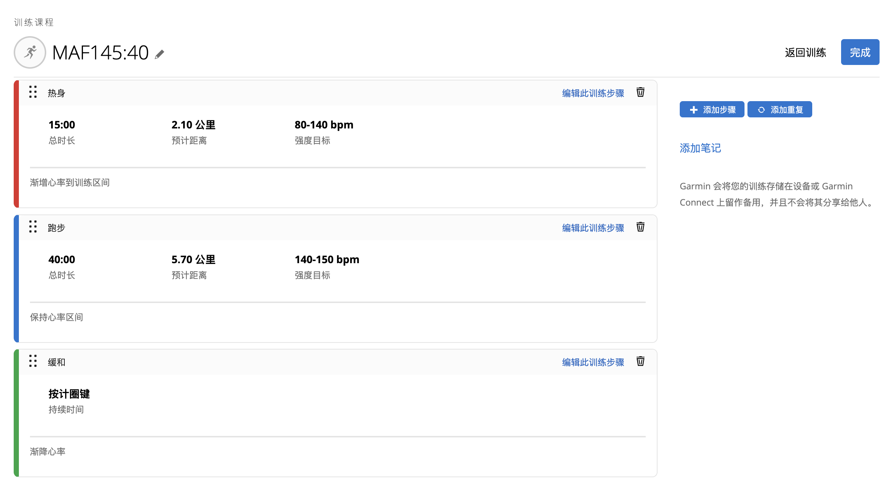

这是一款面向 **入门跑者** 和 **[MAF训练法][maf]跑者** 的，聚焦于跑步训练中 **[速心比](#速心比meters-per-beat)** 指标数据可视化的浏览器扩展程序（俗称：插件）。

[maf]: https://weread.qq.com/web/reader/17632120716aaf23176ca69

目前仅支持配合 Chrome 和 [Garmin Connect 中国][gcc]进行使用。

[gcc]: https://connect.garmin.cn/

## 速心比（Meters Per Beat）

长距离跑步，作为一项有氧为主的耐力运动，其过程中的心率变化，是跑者付出努力程度的直接体现。
将其与速度关联起来，即 *平均速度*[^mpm] 与 *平均心率* 的比值，以便反映身体努力程度与速度的变化关系。
从而更为有效的评估自己每一次严肃的训练表现。这在关注最大有氧能力（MAF）的跑者看来，是显而易见的。

[^mpm]: 平均每分钟跑多少米，可用活动记录中 **平均配速（或平均坡度调整配速）**换算而来。

相较 **最大摄氧量** 和 **乳酸阈值** 这样专业的竞技训练指标而言，速心比是大众跑者在佩戴一款支持GPS和心率的手表，即可实时获知的。
尽管一些专业跑表也提供 [**最大摄氧量**][vomax] 和 [**乳酸阈值**][lt] 估算值，只是在实际使用中，它们时常会与自身的体感有所出入。

[vomax]: https://www.garmin.com.cn/minisite/garmin-technology/firstbeat/#vo2max-fitness-level
[lt]: https://www.garmin.com.cn/minisite/garmin-technology/firstbeat/#lactate-threshold

## 用前提示

你需要：

1. 已有[Garmin Connect 中国][gcc]账号；
1. 此账号下已上传多次类型为 **跑步** 的活动记录。

## 最佳实践

为了更科学地分析对比多次跑步活动的[速心比指标变化](#专项训练表现变化对比)，强烈参考以下实践：



1. 在 **训练课程** 中，创建一个属于自己的跑步专项课程；
1. 课程中至少有 **热身** 和 **跑步** 两个步骤；
1. 步骤中 **持续时间** 和 **训练目标** 可按需调整；
1. 保存并同步至手表，供下次训练使用。

## 构建

```bash
source .envrc
npm ci 
npm run build
```

## 安装

请参见[加载已解压的扩展程序][lupe]。

[lupe]: https://developer.chrome.com/docs/extensions/get-started/tutorial/hello-world#load-unpacked

## 使用

在浏览器中打开并登录 [Garmin Connect 中国][gcc]。

### 跑步活动速心比概览


1. 访问[跑步活动页][runnings]；
1. 点击扩展程序图标，即展开侧边面板。

[runnings]: https://connect.garmin.cn/modern/activities?activityType=running

### 专项课程活动变化对比

1. 访问[训练课程页][workouts]；
1. 选择一个[训练课程](#最佳实践)点击进入；
1. 点击扩展程序图标，即展开侧边面板。

[workouts]: https://connect.garmin.cn/modern/workouts